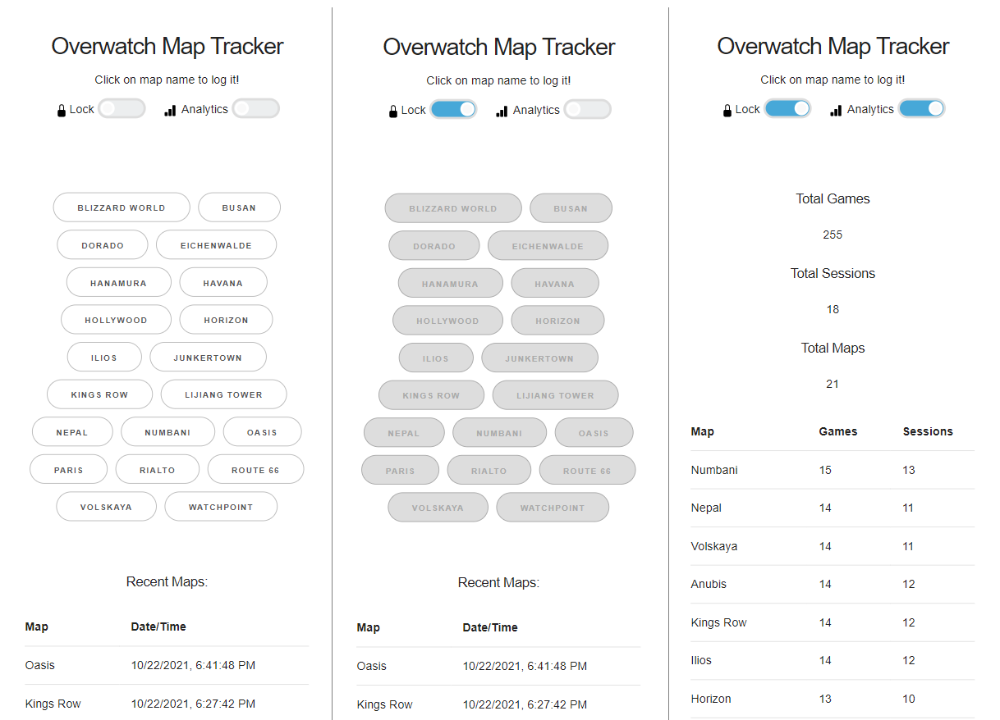

# Overwatch Map Tracker

The idea of this project is to easily track which OW maps (QP/Comp) you get, and then analyze the frequency of each map occuring.

The UI is a simple web page that can be opened on your mobile device locally, and the server is a light express app to read/write the map log via a CSV file (`db.csv`).

## How To Use

 - Run the application (see "How to deploy" below) on your PC
 - When ready, the application will show a QR code - scan it on your mobile device to access the app
 - Click on a map name to log it. The buttons will be locked out for 5 seconds to prevent accidental duplicate records.
 - Toggle "Lock" mode to manually lock the buttons, to avoid accidental clicks
 - Toggle "Analytics" mode to see the latest stats

## How to deploy

1. Clone the repo
1. Run `npm install`
1. Run `npm start`
1. Open the URL or QR code shown in console on your mobile device

## Attributions / Dependencies

 - Base CSS from: normalize.css: [git.io/normalize](https://git.io/normalize)
 - Base CSS from: Skeleton: [www.getskeleton.com](https://www.getskeleton.com)
 - SVG Icons from: Bootstrap Icons [icons.getbootstrap.com](https://icons.getbootstrap.com/)
 - Pure CSS Loaders from: loading.io [loading.io/css/](https://loading.io/css/)
 - Pure CSS Toggle from: [https://codepen.io/thom-nic/pen/BNLdyY](https://codepen.io/thom-nic/pen/BNLdyY) by [Thom Nichols](https://github.com/thom-nic)
 - [node-qrcode](https://www.npmjs.com/package/qrcode)
 - [express](https://www.npmjs.com/package/express)
 - [ip](https://www.npmjs.com/package/ip)
